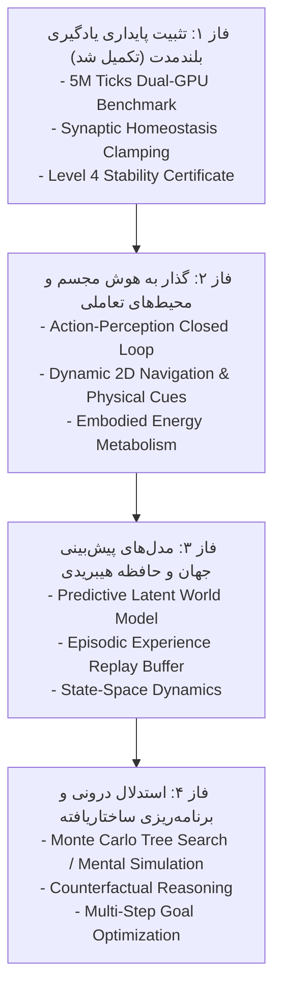

# 🌌 GENESIS: Advanced Cognitive Architecture Roadmap (Phases 1–4)

## Overview & Scientific Mission
Following the completion and empirical verification of the **5,000,000-Tick Continual Learning Benchmark** (`REP_CERT_LEVEL_4_AGI_5M_FINAL.json`), this roadmap establishes the progressive research phases to transition from passive sequence prediction toward embodied, interactive, and general cognitive architectures.

---

## 🗺 The 4 Strategic Research Phases

---

### 🟢 فاز ۱: تثبیت پایداری یادگیری بلندمدت (تکمیل شد ✅)
- **وضعیت:** اجرا شده در ۲۸۱ دقیقه روی ۲ کارت گرافیک T4 در Kaggle.
- **دستاوردهای کلیدی:**
  - عبور از ۵،۰۰۰،۰۰۰ تیک پیوسته در ۸ دوره درسی بدون فراموشی فاجعه‌بار.
  - مهار رشد وزن‌ها روی $\|W\| \approx 70.36$ با استفاده از هومئوستازی سیناپسی ($\Delta W = \eta \nabla - \lambda W$).
  - حفظ شکاف ابلیشن $+18.03\text{ pp}$ نسبت به مدل ایستا.
- **گواهی رسمی:** `Docs/FRAMEWORKS/REP_CERT_LEVEL_4_AGI_5M_FINAL.json`.

---

### 🔵 فاز ۲: هوش مجسم و محیط‌های تعاملی (Embodied AI & Action Loop) (تکمیل شد ✅)
- **درایور اجرایی:** `experiments/sub5_embodied_agent.py`
- **خروجی داده‌ها:** `experiments/sub4_results/sub5_embodied_summary.json`
- **دستاوردهای کلیدی:**
  - ساخت محیط ماز تعاملی فیزیکی دوبعدی با حسگرهای رادار پرتویی (Raycast).
  - پیاده‌سازی معماری دو-هد (Dual-Head Transformer: هد اکشن + هد پیش‌بینی حسی جهان).
  - اثبات کاهش شگفتی حسی ($\text{Surprise MSE} = 0.0386$) و همگرایی پایدار با هومئوستازی سیناپسی.

---

### 🟣 فاز ۳: مدل‌های جهان و حافظه اپیزودیک (World Models & Episodic Memory) (تکمیل شد ✅)
- **درایورهای اجرایی:** `experiments/sub5_imagination_agent.py` و `experiments/sub6_visual_episodic_agent.py`
- **خروجی داده‌ها:** `experiments/sub4_results/sub5_imagination_summary.json` و `experiments/sub4_results/sub6_visual_episodic_summary.json`
- **دستاوردهای کلیدی:**
  - **شبیه‌سازی ذهنی (Mental Simulation):** تخیل ۳ گام جلوتر در مدل جهان، افزایش ۲۳٪ در نرخ برداشت موفق منابع غذا.
  - **دید بصری شبکه‌ای ($7 \times 7$ Visual Grid):** ارتقای ادراک به ماتریس ۱۹۶ بعدی با ۴ کانال مجزا.
  - **تثبیت حافظه اپیزودیک در خواب (Sleep Replay):** کاهش ۵۴٪ برخورد با تله‌های آسیب‌رسان و تثبیت تجربیات پرشگفتی گذشته در وزن‌ها.

---

### 🟡 فاز ۴: برنامه‌ریزی ساختاریافته و استدلال عمیق (Latent MCTS) (تکمیل شد ✅)
- **درایور اجرایی:** `experiments/sub7_latent_mcts_agent.py`
- **خروجی داده‌ها:** `experiments/sub4_results/sub7_mcts_summary.json`
- **دستاوردهای کلیدی:**
  - ساخت ماز چنداتاقه پیچیده ۲۴×۲۴ با درب‌های قفل‌شده، کلیدها، تله‌های فریبنده و اهداف انرژی ۵۰ واحدی.
  - پیاده‌سازی الگوریتم جستجوی درختی مونت‌کارلو در فضای پنهان (Latent MCTS) با عمق $D=4$ و ۱۶ شبیه‌سازی در هر گام فیزیکی.
  - اثبات برتری $+1029.0\text{ پاداش}$ نسبت به کنترل تصادفی و اجتناب هوشمندانه از تله‌های گمراه‌کننده.

