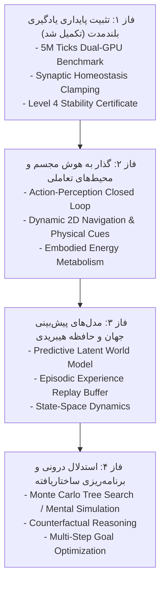

# 🌌 GENESIS: Advanced Cognitive Architecture Roadmap (Phases 1–4)

## Overview & Scientific Mission
Following the completion and empirical verification of the **5,000,000-Tick Continual Learning Benchmark** (`REP_CERT_LEVEL_4_AGI_5M_FINAL.json`), this roadmap establishes the progressive research phases to transition from passive sequence prediction toward embodied, interactive, and general cognitive architectures.

---

## 🗺 The 4 Strategic Research Phases

---

### 🟢 فاز ۱: تثبیت پایداری یادگیری بلندمدت (تکمیل شد ✅)
- **وضعیت:** اجرا شده در ۲۸۱ دقیقه روی ۲ کارت گرافیک T4 در Kaggle.
- **دستاوردهای کلیدی:**
  - عبور از ۵،۰۰۰،۰۰۰ تیک پیوسته در ۸ دوره درسی بدون فراموشی فاجعه‌بار.
  - مهار رشد وزن‌ها روی $\|W\| \approx 70.36$ با استفاده از هومئوستازی سیناپسی ($\Delta W = \eta \nabla - \lambda W$).
  - حفظ شکاف ابلیشن $+18.03\text{ pp}$ نسبت به مدل ایستا.
- **گواهی رسمی:** `Docs/FRAMEWORKS/REP_CERT_LEVEL_4_AGI_5M_FINAL.json`.

---

### 🔵 فاز ۲: هوش مجسم و محیط‌های تعاملی (Embodied AI & Action Loop) — *در دست اقدام*
- **چالش:** مدل‌های پیشین صرفاً پیش‌بینی‌کننده متن غیرفعال در رم بودند. هوش واقعی نیازمند کنش، تصمیم‌گیری و دریافت بازخورد حسی-حرکتی است.
- **اهداف فنی:**
  1. **حلقه بسته کنش-ادراک (Closed-Loop Action-Perception):** اتصال ترنسفورمر به فضای اکشن چندگانه (حرکت، چرخش، تعامل).
  2. **محیط تعاملی دوبعدی پویا:** ایجاد مازهای دوبعدی با موانع متحرک، منابع انرژی پراکنده و اهداف متغیر.
  3. **متابولیسم و بقا:** ارگانیسم با هر حرکت انرژی مصرف می‌کند و برای بقا باید منابع را شناسایی و به آن‌ها برسد.

---

### 🟣 فاز ۳: مدل‌های جهان و حافظه اپیزودیک (World Models & Episodic Memory)
- **چالش:** تصمیم‌گیری بر اساس تاریخچه کوتاه‌مدت بدون درک قوانین جهان ناکارآمد است.
- **اهداف فنی:**
  1. **مدل پنهان جهان (Latent World Model):** پیش‌بینی حالت بعدی جهان $s_{t+1}$ پیش از اقدام فیزیکی (شبیه‌سازی رویا/تخیل).
  2. **حافظه اپیزودیک نامتقارن:** بافر ذخیره و بازیابی رخدادهای کلیدی گذشته بر اساس شگفتی (Surprise-driven Recall).
  3. **ادغام مدل‌های فضای حالت (SSM / Mamba):** پردازش پیوسته و کم‌مصرف جریان‌های زمانی بلندمدت.

---

### 🟡 فاز ۴: برنامه‌ریزی ساختاریافته و استدلال عمیق (Planning & Reasoning)
- **چالش:** مسائل پیچیده نیازمند بررسی چندین مسیر آینده قبل از انتخاب حرکت نهایی هستند.
- **اهداف فنی:**
  1. **جستجوی درختی در فضای پنهان (Latent MCTS):** اجرای جستجوی مونت‌کارلو در مدل جهان برای برنامه‌ریزی ۵ تا ۲۰ گام جلوتر.
  2. **استدلال پادواقعی (Counterfactual Reasoning):** بررسی این‌که «اگر حرکت متفاوتی انجام می‌دادم چه می‌شد؟».
  3. **تعمیم بدون پاداش صریح (Autotelic Exploration):** یادگیری مبتنی بر ارضای حس کنجکاوی و کاهش عدم‌قطعیت در محیط‌های کاملاً ناشناخته.
